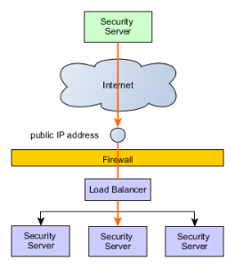
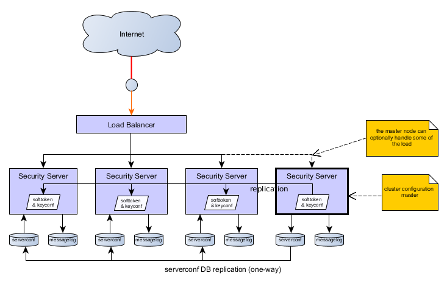

# X-Road: External Load Balancer Installation Guide (Work in progress)

Version: 1.0  
Doc. ID: IG-XLB

| Date       | Version     | Description                                             | Author             |
|------------|-------------|---------------------------------------------------------|--------------------|
| X.3.2017   | 1.0         | Initial version                                         | Olli Lindgren      |

## Table of Contents

<!-- toc -->

  * [License](#license)
- [1. Introduction](#1-introduction)
  * [1.1 Target Audience](#11-target-audience)
  * [1.2 References](#12-references)
- [2. Installation](#2-installation)

<!-- tocstop -->

## License

This document is licensed under the Creative Commons Attribution-ShareAlike 3.0 Unported License. To view a copy of this license, visit http://creativecommons.org/licenses/by-sa/3.0/.

# 1. Introduction

## 1.1 Target Audience

The intended audience of this installation guide are the X-Road security server administrators responsible for installing and configuring the X-Road security server software.
The document is intended for readers with a good knowledge of Linux server management, computer networks, database administration and the X-Road functioning principles.

## 1.2 References

**FIXME:** to a table
1. [UG-CS] Cybernetica AS. X-Road 6. Central Server User Guide
2. [IG-SS] Cybernetica AS. X-Road 6. Security Server Installation Guide
3. [UG-SS] Cybernetica AS. X-Road 6. Security Server User Guide
4. [IG-CSHA] Cybernetica AS. X-Road 6. Central Server High Availability Installation Guide

# X. Overview
**FIXME:** check passive/active voice

This document describes the external load balancing support features implemented by X-Road. The supported setup consists
of security servers in a cluster having an identical configuration, including their keys and certificates.
X-Road security server configuration changes are handled by a single master server and one or more slave servers (nodes).

The primary goal of the load balancing support is, as the name suggests, load balancing, not fault tolerance.
A clustered environment increases fault tolerance but some X-Road messages can still be lost if a security server node fails.

The implementation does not include a load balancer component. It should be possible to use any external load balancer
component that supports HTTP-based heath checks and load balancing at the TCP level (eg. haproxy, nginx, AWS ELB or
Classic Load Balancing, or a hardware appliance).

The load balancing support is implemented with a few assumptions about the environment that users should be aware of. Carefully consider
these assumptions before deciding if the supported features are suitable for your needs.

__Basic Assumptions about the load balanced environment:__
* Adding or removing nodes to or from the cluster is infrequent. **FIXME:** Mihin vaikuttaa?
* Configuration changes are relatively infrequent and some downtime in ability to change configuration can be tolerated.
  (The cluster uses a master-slave model and the configuration master is not replicated.)
  
__Consequences of the selected implementation model:__  
* Changes to the ServerConf database, authorization and signing keys are applied via the configuration master, which is
  a member of the cluster. The replication is one-way from master to slaves and the slaves should treat the configuration as read-only.
* The cluster nodes can continue operation if the master fails but the configuration can not be changed until:
  - the master becomes back on-line, or
  - some other node is manually promoted to the master. 
* If a node fails, the messages being processed by that node are lost.
  - It is the responsibility of the load balancer component to detect the failure and route further messages to other nodes.
    Because there potentially is some delay before the failure is noticed, some messages might be lost due to the delay.
  - Recovering any lost messages is currently out-of-scope of the support implementation.
* Configuration updates are asynchronous and the cluster state is eventually consistent.
* If the master node fails or communication is interrupted during a configuration update, each slave should have a valid configuration,
  but the cluster state can be inconsistent (some members might have the old configuration while some might have received all the changes).
  
## Communication with external servers -- The Cluster from the point of view of a SS client

When external security servers communicate with the cluster, they see only the cluster public IP address which is registered to the global configuration as the security server address. From the caller point of view this case is analogous to making a request to a single security server.

When a security server makes a request to an external server (security server, OCSP, TSA or a central server), the external server again sees only the public IP address. Note that depending on the configuration, the public IP address might be different from the one used in the previous scenario. It should also be noted that the security servers will independently make requests to OCSP, TSA and central server (global configuration fetch) as needed.

## State replication from the master to the slaves

| messagelog database | not replicated       | N/A                                            | Each node has its own (separate) messagelog database. **Note:** In order to support PostgreSQL streaming replication (hot standby mode), the serverconf and messagelog databases must be separated.
                                                                                                
**FIXME:** taulukon header, "State" -> "Object", "Data"?
### Serverconf database replication
| State               | Replication          | Replication method                                 |
| ------------------- | -------------------- | -------------------------------------------------- |
| serverconf database | **replication required** | PostgreSQL streaming replication (Hot standby) |

The serverconf database replication can be implemented with minimal code changes using database replication (hot standby
or BDR). Note that PostgreSQL replication is all-or-nothing, it is not possible exclude databases from the replication.
This is why serverconf and messagelog databases need to be separated to different instances.

### Messagelog database replication
| State               | Replication          | Replication method                                 |
| ------------------- | -------------------- | -------------------------------------------------- |
| messagelog database | **not replicated** |                                                      |

The messagelog database is not replicated. Each node has its own separate messagelog database. **However**, in order to
support PostgreSQL streaming replication (hot standby mode) for the serverconf data, the serverconf and messagelog
databases must be separated. This requires modifications to the installation (a separate PostgreSQL instance is needed
for the messagelog database) and has some implications on the security server resource requirements as since a separate
instance uses some memory.

### Key configuration and software token replication from `/etc/xroad/signer/*`
| State                           | Replication          | Replication method                                 |
| ------------------------------- | -------------------- | -------------------------------------------------- |
| keyconf and the software token  | **replicated**       |  `rsync+ssh`  (scheduled)                          |

Previously, any external modification to `/etc/xroad/signer/keyconf.xml` is overwritten by the X-Road signer process if
it was running. Therefore, replicating the signer configuration without service disruptions would have required taking the
cluster members offline one-by-one. The load balancing support adds the possibility for external modifications to the
keyconf.xml to be applied on slave nodes without service disruptions. The actual state replication is done with a scheduled
rsync over ssh. This might take a few minutes so a slight delay in propagating the changes must be tolerated by the
clustered environment. A small delay should usually cause no problems as new keys and certificates are unlikely to be used
immediately for X-Road messaging. Changes to the configuration are also usually relatively infrequent. These were one of
the [basic assumptions](#basic_assumption) about the environment. Users should make sure this holds true for them.

The slave nodes use the `keyconf.xml` in read-only mode, no changes are persisted to disk. Slaves reload the configuration
from disk periodically and apply the changes to their running in-memory configuration.

### Other server configuration parameters from `/etc/xroad/*`
| State                                 | Replication          | Replication method                                 |
| ------------------------------------- | -------------------- | -------------------------------------------------- |
| other server configuration parameters | **replicated**       |  `rsync+ssh`  (scheduled)                          |

The following configurations are excluded from replication:
* `db.properties` (node-specific)
* `postgresql/*` (node-specific keys and certs)
* `globalconf/` (syncing globalconf could conflict with `confclient`)
* `conf.d/node.ini` (specifies node type: master or slave)

### OCSP response replication from `/var/cache/xroad/`
| State                                 | Replication          | Replication method                                 |
| ------------------------------------- | -------------------- | -------------------------------------------------- |
| other server configuration parameters | **not replicated**   |  `rsync+ssh`  (scheduled)                          |

The OCSP responses are currently not replicated. Replicating them could make the cluster more fault tolerant but the
replication cannot simultaneously create a single point of failure. A distributed cache could be used for the responses.

# Security server cluster setup -- REFACTOR

This ansible playbook configures a master (1) - slave (n) security server cluster. In addition, setting up a load balancer (out of scope) is needed.

The playbook has been tested in AWS EC2 using stock RHEL 7 and Ubuntu 14.04 AMIs running default X-Road security server installation. Other environments might require modifications to the playbook.

## Prerequisites

* One security server that acts as master
* One or more slave security servers.
* The slave server(s) have network access to master ssh port (tcp/22)
* The slave server(s) have network access to master serverconf database (default: tcp/5433)
* X-Road security server packages have been installed on each server
    * It is not necessary to configure the servers
    * The master server configuration is preserved, so it is possible to create a cluster using an existing security server that is already attached to an X-Road instance.
* The control host executing this playbook has ssh access with sudo privileges on all the hosts.
    * Ansible version >2.1 required
    * The control host can be one of the cluster servers (e.g. the master node), but a separate control host is recommended.
* Decide names for the cluster members and configure the nodes in the ansible inventory. 
    * See hosts/cluster-example.txt for an example (nodename parameter)
    * Node names are related to certificate DN's, see "Set up SSL keys" for specifics
* Change the serverconf_password in group_vars/all and preferably encrypt the file using ansible vault. 
    * The serverconf_password is used to authenticate the local connections to the serverconf database. The default is 'serverconf'.

All the servers in a cluster should have the same operating system (Ubuntu 14.04 or RHEL 7). The setup also assumes that the servers are in the same subnet. If that is not the case, one needs to modify master's pg_hba.nconf so that it accepts replication configurations from the correct network(s).

## Set up SSL keys certificates for PostgreSQL replication connections

Create a CA certificate and store it in PEM format as ca.crt in the "ca" folder. Create TLS key and certificate (PEM) signed by the CA for each node and store those as ca/"nodename"/server.key and ca/"nodename"/server.crt. The server keys must not have a passphrase, but one can and should use ansible-vault to protect
the keys.

Note that the common name (CN) part of the certificate subject's DN must be the *nodename* defined in the host inventory file.

The ca directory contains two scripts that can be used to generate the keys and certificates.
* init.sh creates a CA key and self-signed certificate.
* add-node.sh creates a key and a certificate signed by the CA.

# 2. Installation

